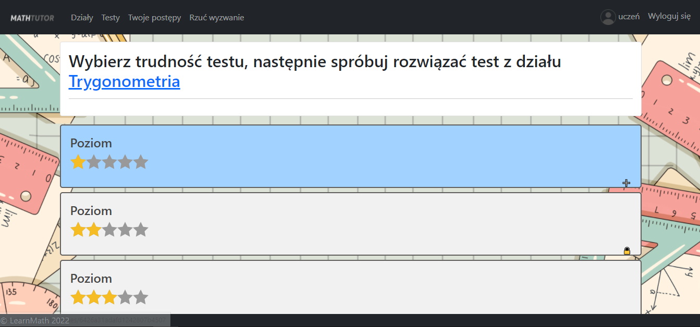
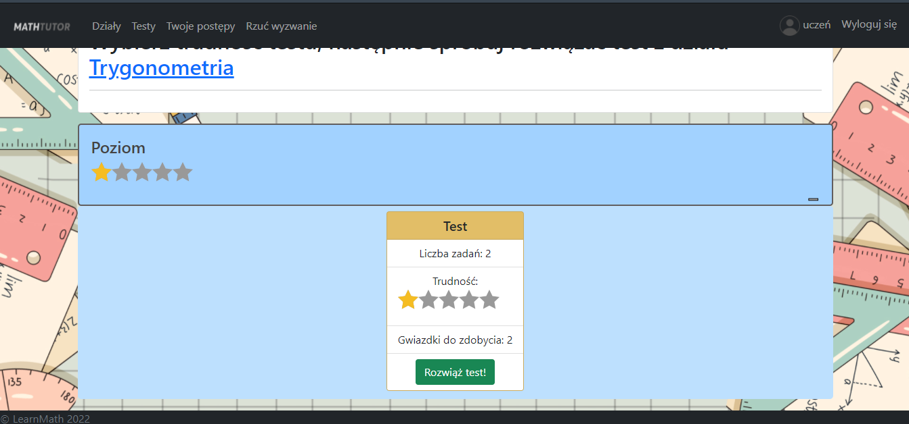
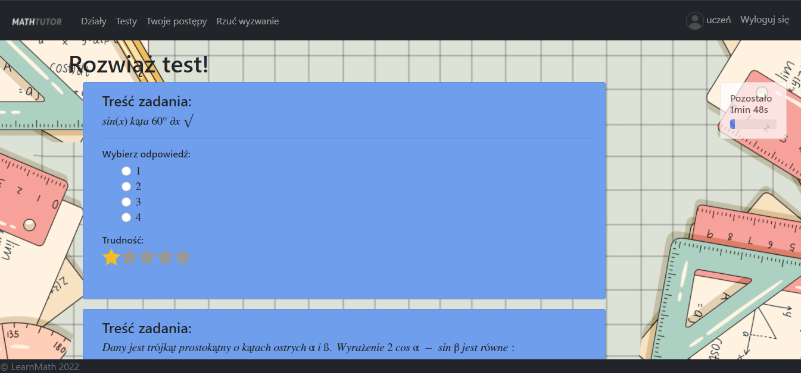
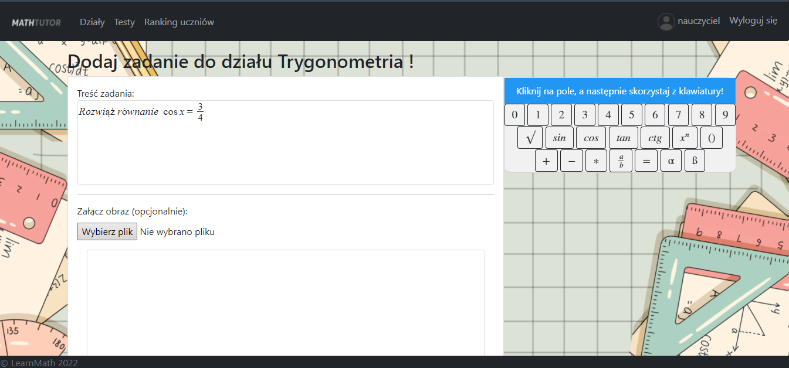
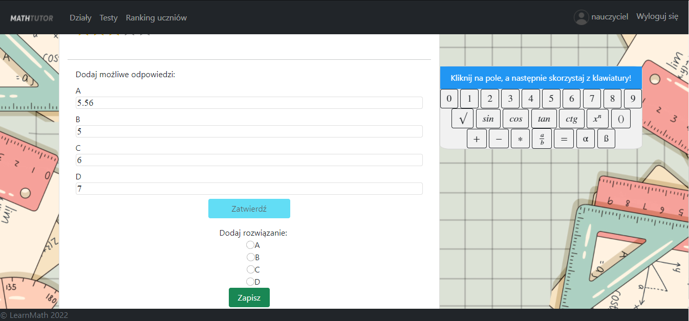

# Math learnig support web application - LearnMath
Following application supports high school students in learnig basics math issues. Website may also be a tool used by teachers to create exercises and tests, which then will be solved by students.

## Requirements

- Install Node.js
- Install MongoDB


## Built With

* 
* 
* 
* 
* 
* 


## Project structure

Folder name  | Contents
------------- | -------------
controllers | procedures called on given HTTP requests
models  | mongoose database models definitions
public  | public assets (js packages, images and stylesheets)
routes  | HTTP endpoints for db models 
utils  | backend and frontend error handling
views  | ejs views templates


## Local setup

After cloning repo, cd into learnMath directory, then install Node modules by:

```
npm-install
```

Then setup database, below command will connect and insert basic data into database:

```
node seeds.js
```

To start application execute:

```
nodemon server.js
```
## Basic scenario

Solving test (student user):





Creating math exercise for given branch (teacher user):


